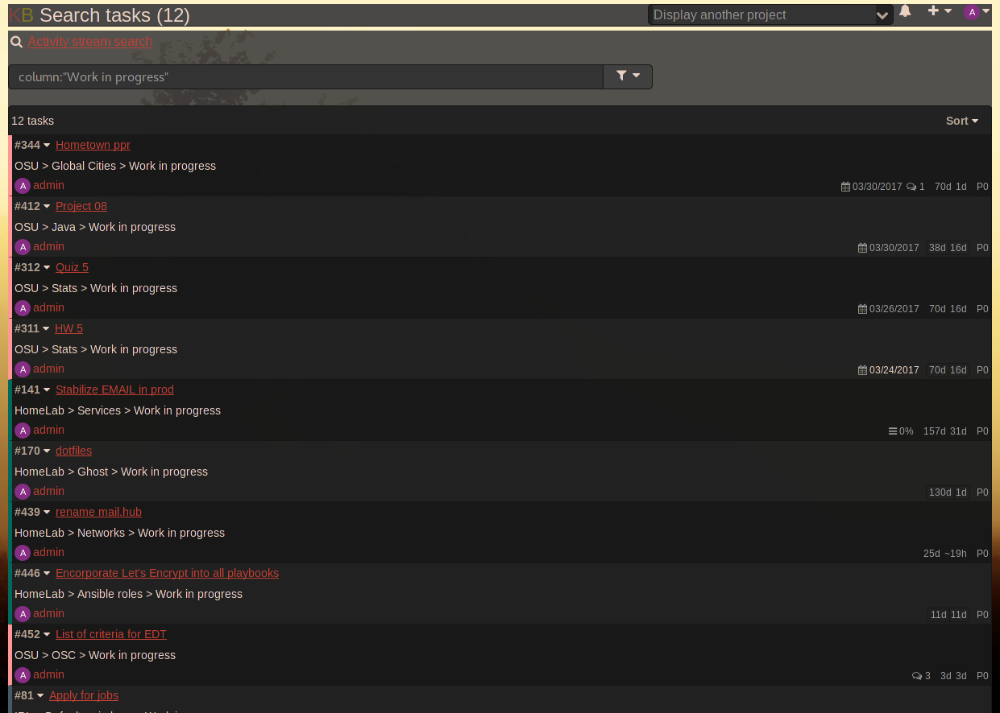
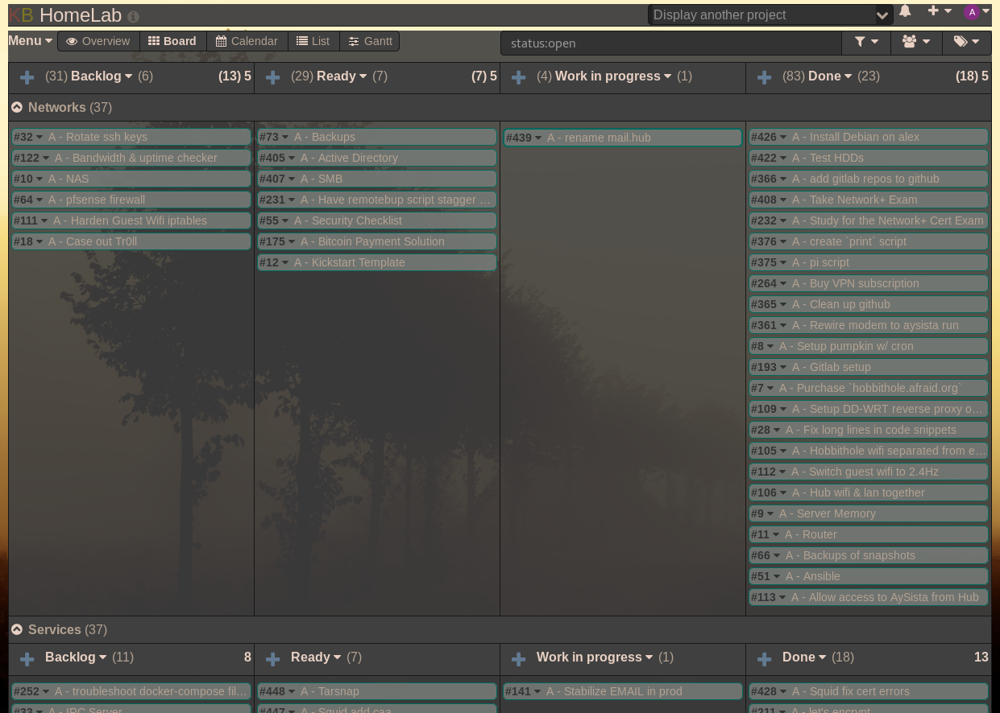

Example of CSS plugin
=====================

This plugin add a new stylesheet and override default styles.

Installation
------------

- Create a directory **Css** under the folder **plugins**
- Copy all source files into this new directory

Author
------

`andrewcz@neomailbox.net`

The example stylesheet come from the [issue #1248](https://github.com/fguillot/kanboard/issues/1248) created by @oliverh72

Screenshot
----------

